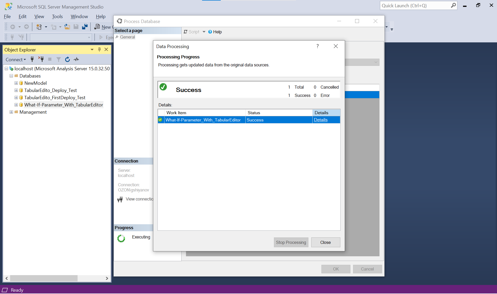

### What-If Parameter With TabularEditor

This repo is about creating What-If Parameters with Tabular Editor. 
Scenarios in which you may need this solution include:

- You have datasets published on SSAS On-Premises/Azure Analysis Services/Power BI Premium
- You store you Model in a folder structure rather than ***Model.bim*** file
- You [deploy your folder structure](https://www.youtube.com/watch?v=fzZgXe3MjhI) with [Azure DevOps](https://azure.microsoft.com/en-us/products/devops)

The full code is available [here](./What_If_Parameter_With_TabularEditor.csx).


Here are the steps:
1. Copy the code from *.csx file


2. Open your solution in Tabular Editor


3. Paste the code into Tabular Editor ***C# Script*** window


4. Run macro and follow the steps in it

	4.1 Configure the What-If Parameter just like you would in Power BI
    

	4.2 Check results of the script
	
    
	4.3 Save model back to the folder structure (or ***Model.bim*** file) and deploy the model to your environment (with Model->Deploy)
	


5. Now it's time to process our changes

	5.1. Open and process your model in SQL Server Management Studio
	
	
	5.2. While processing, choose ***Process Recalc***. (also known as *calculate*)
    ```
	{
	  "refresh": {
		"type": "calculate",
		"objects": [
		  {
			"database": "What-If-Parameter_With_TabularEditor"
		  }
		]
	  }
	}
	```
	
	
	5.3. Wait for process to finish
	


6. Check that model works as expected.

	6.1. With DAX Studio
	

	6.2. With Power BI Desktop
	
	Default value:
	
	Slicer value:
	


